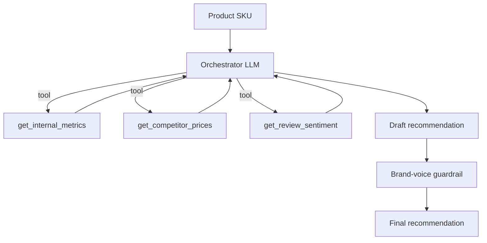

# Commerce AI Ops Agent

A multi-tool agent that produces merchandising recommendations for an
e-commerce catalog. Given a product SKU, it gathers internal metrics,
competitor prices, and review sentiment, then recommends pricing, inventory,
and promotional actions - with a brand-voice guardrail and full observability.

Built from scratch on the raw Anthropic SDK (orchestrator-workers pattern),
then reimplemented in LangGraph for comparison (see `langgraph_version/`).

## Architecture



## LangGraph version

`langgraph_version/` reimplements the same agent twice:

- `agent_prebuilt.py` - the prebuilt ReAct agent (`create_agent`), tools only,
  no guardrail.
- `agent_graph.py` - a custom `StateGraph` that makes the guardrail an explicit
  node, so the agent -> guardrail handoff is part of the graph rather than glue
  code around it.

The graph below is generated from the compiled app itself
(`app.get_graph().draw_mermaid()`), not drawn by hand:


The `agent` node runs the inner ReAct loop over the three tools and writes a
draft into state; the `guardrail` node rewrites that draft for brand voice and
records any violations it found.

## Run

```bash
uv sync
export ANTHROPIC_API_KEY=...
uv run python agent.py GM-001
```

LangGraph versions:

```bash
cd langgraph_version
uv run python agent_prebuilt.py GM-001    # prebuilt ReAct agent
uv run python agent_graph.py GM-001       # custom graph with guardrail node

# regenerate the Mermaid diagram above
uv run python -c "from agent_graph import app; print(app.get_graph().draw_mermaid())"
```

## Evaluation

Outcome evaluation against per-SKU reference expectations. See `evals/`.

## What this demonstrates

- Orchestrator-workers agent pattern (raw SDK, no framework)
- Multi-tool use where tool outputs feed subsequent tool inputs
- Evaluator-optimizer guardrail for output quality
- The same agent expressed as an explicit LangGraph state machine
- Full Langfuse observability (cost and latency per run)
- Outcome + light trajectory evaluation
