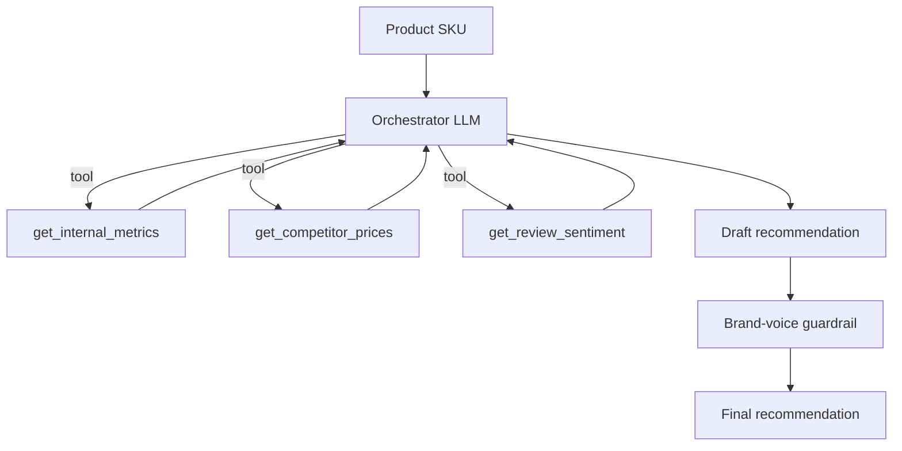
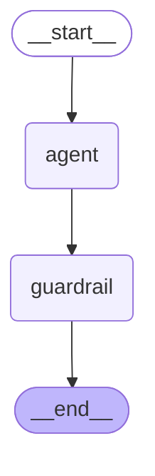

# Commerce AI Ops Agent

A multi-tool agent that produces merchandising recommendations for an
e-commerce catalog. Given a product SKU, it gathers internal metrics,
competitor prices, and review sentiment, then recommends pricing, inventory,
and promotional actions - with a brand-voice guardrail and full observability.

The same agent is implemented three ways - raw Anthropic SDK, LangGraph and
CrewAI - over the same tools, model and guardrail, and scored by one outcome
eval, so the framework question gets answered with measurements rather than
taste. [`IMPLEMENTATIONS.md`](IMPLEMENTATIONS.md) is the comparison and when to
reach for which.

| Implementation | File | Shape |
| --- | --- | --- |
| Raw SDK | `agent.py` | hand-written orchestrator-workers loop, full Langfuse tracing |
| LangGraph prebuilt | `langgraph_version/agent_prebuilt.py` | `create_agent` ReAct loop, no guardrail |
| LangGraph custom | `langgraph_version/agent_graph.py` | `StateGraph` with agent and guardrail nodes |
| CrewAI | `crewai_demo.py` | analyst + brand copywriter crew, task guardrail |

The short version: across 24 eval runs the four are indistinguishable on outcome
scores. They differ in lines of code, latency, how visible the flow is, and how
much of it Langfuse can see.

## Architecture



## LangGraph version

`langgraph_version/` reimplements the same agent twice:

- `agent_prebuilt.py` - the prebuilt ReAct agent (`create_agent`), tools only,
  no guardrail.
- `agent_graph.py` - a custom `StateGraph` that makes the guardrail an explicit
  node, so the agent -> guardrail handoff is part of the graph rather than glue
  code around it.

The graph below is generated from the compiled app itself
(`app.get_graph().draw_mermaid()`), not drawn by hand:



The `agent` node runs the inner ReAct loop over the three tools and writes a
draft into state; the `guardrail` node rewrites that draft for brand voice and
records any violations it found.

## Run

```bash
uv sync
export ANTHROPIC_API_KEY=...
uv run python agent.py GM-001
```

LangGraph versions:

```bash
cd langgraph_version
uv run python agent_prebuilt.py GM-001    # prebuilt ReAct agent
uv run python agent_graph.py GM-001       # custom graph with guardrail node

# regenerate the Mermaid diagram above
uv run python -c "from agent_graph import app; print(app.get_graph().draw_mermaid())"
```

CrewAI version:

```bash
uv run python crewai_demo.py GM-001
```

## Evaluation

Outcome evaluation against per-SKU reference expectations, scored by an LLM
judge, run across every implementation with measured lines of code and latency
alongside the scores:

```bash
uv run python evals/agent_eval.py                                   # all four
uv run python evals/agent_eval.py --impl raw-sdk langgraph-custom --trials 3
```

Results and caveats are in [`IMPLEMENTATIONS.md`](IMPLEMENTATIONS.md).

## What this demonstrates

- Orchestrator-workers agent pattern (raw SDK, no framework)
- Multi-tool use where tool outputs feed subsequent tool inputs
- Evaluator-optimizer guardrail for output quality
- The same agent across raw SDK, LangGraph and CrewAI, compared on one eval
- The guardrail as a loop call, a graph node, and a CrewAI task guardrail
- Full Langfuse observability on the raw SDK path (cost and latency per run)
- Outcome evaluation with an LLM judge against per-SKU reference expectations
